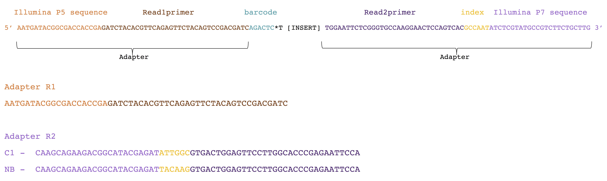
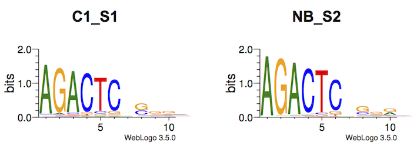
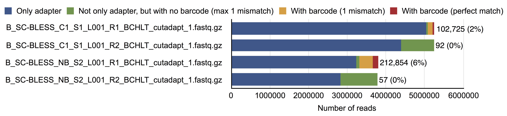

# BLISS test

Analysis of BLISS test runs performed in June 2018. 

The commands used can be found in [`cmd.sh`](cmd.sh).

## Basic questions

1. How many reads start with the barcode ('AGACTCT', or 'AGACTC')?
2. How many reads can be mapped to a reference human genome?
3. How many reads can be mapped to telomeres?

## Input data

The input fastq files were downloaded from [here](http://bio4.cent.uw.edu.pl/BCHLT) to the `fastq` directory, but are also accessible on the server (`bigram:/ngs/Fastq/new_BCHLT/`). They correspond to sequencing results from two samples.

This is how sequences were designed:



## Adapter trimming

The steps below were done knowing that the overrepresented sequences found by FastQC were reverse complement sequences of the opposite adapters (R1 <> R2). This was due to formation of "dimers", without prior ligation of the barcode between adapters.

All commands used are in [`cmd_3.sh`](cmd_3.sh).

* In the beginning there are:
	* 5,253,177 C1_S1 paired reads
	* 3,793,031 NB_S2 paired reads

* Reads with the native adapters in R1 at the 5' end were discarded with [cutadapt](https://cutadapt.readthedocs.io/): `cutadapt -g AATGATACGGCGACCACCGAGATCTACACGTTCAGAGTTCTACAGTCCGACGATC --discard-trimmed --minimum-length 6 -o trim_adapters/B_SC-BLESS_C1_S1_L001_R1_BCHLT_cutadapt_native_adapters.fastq.gz -p trim_adapters/B_SC-BLESS_C1_S1_L001_R2_BCHLT_cutadapt_native_adapters.fastq.gz fastq/B_SC-BLESS_C1_S1_L001_R1_BCHLT.fastq.gz fastq/B_SC-BLESS_C1_S1_L001_R2_BCHLT.fastq.gz > analysis/cutadapt_native_adapters.out`
	* 7,074 (0.1%) R1 reads discarded in C1_S1
	* 4,686 (0.1%) R1 reads discarded in NB_S2
	* *So, in general, R1 reads were free from R1 adapters.*

* We also want to trim the R2 reverse complement (R2_RC) adapter from R1 reads at the 3' end: `cutadapt -a TGGAATTCTCGGGTGCCAAGGAACTCCAGTCACGCCAATATCTCGTATGCCGTCTTCTGCTTG --minimum-length 6 -o trim_adapters/B_SC-BLESS_C1_S1_L001_R1_BCHLT_cutadapt_native_adapters_2.fastq.gz -p trim_adapters/B_SC-BLESS_C1_S1_L001_R2_BCHLT_cutadapt_native_adapters_2.fastq.gz trim_adapters/B_SC-BLESS_C1_S1_L001_R1_BCHLT_cutadapt_native_adapters.fastq.gz trim_adapters/B_SC-BLESS_C1_S1_L001_R2_BCHLT_cutadapt_native_adapters.fastq.gz > analysis/cutadapt_native_adapters_2.out`
	* 5,032,988 (95.9%) R1 reads with R2_RC adapter in C1_S1
	* 3,229,386 (85.2%) R1 reads with R2_RC adapter in NB_S2
	* *In general, around 90% of R1 reads contain R2_RC adapter.*

* The above steps were repeated for R2 reads.

* The resulting reads of minimum 6 nt are at `trim_adapters/*cutadapt_native_adapters_4.fastq.gz`:
	* 4,017,871 reads in C1_S1
	* 3,040,363 reads in NB_S2

## Barcode presence

This paragraph corresponds to commands from [`cmd_4.sh`](cmd_4.sh).

* Histogram of read lengths (with barcodes left) is shown in [a plot](analysis/read_length_distribution.pdf). 
* The first and last 10 nucleotides in R1 and R2 reads, respectively, plotted in [WebLogo](https://weblogo.berkeley.edu/logo.cgi):


* Therefore, we assume barcode as 'AGACTC' (and 'GAGTCT'/'CAGTCT' at 3' end for R2 reads *as C is very common at the R2 5' ends*). Numbers of R1 reads starting with the exact barcode:
	* 2,463,583 (46.9% of total) in C1_S1:
		* among which 2,349,656 (44.7% of total) have the barcode (max. one mismatch) in R2
	* 2,061,719 (54.0% of total) in NB_S1
		* among which 1,902,007 (50.1% of total) have the barcode (max. one mismatch) in R2

* <a name="first_R2"></a>R2 reads start usually with C, followed by GG (logo for [`C1`](mapping/C1_S1_R2_first10.pdf) and [`NB`](mapping/NB_S2_R2_first10.pdf)).

* Filtered and trimmed reads (min 1 nt, trimmed from both sides) were written to [`barcodes`](barcodes) and analyzed with FastQC ([C1_R1](FastQC/B_SC-BLESS_C1_S1_L001_R1_BCHLT_barcodes_fastqc.html), [NB_R1](FastQC/B_SC-BLESS_NB_S2_L001_R1_BCHLT_barcodes_fastqc.html)).

## Mapping to human genome

This paragraph corresponds to commands from [`cmd_5.sh`](cmd_5.sh).

* Only reads of length at least 30 nt (R1) were left for mapping (`barcodes/*barcodes_2_30.fastq.gz`):
	* 277,829 R1 (5.3% of the initial reads) in C1_S1
		* among which 238,841 R2 have at least 1 nt
			* among which 72,801 R2 have at least 30 nt
	* 692,904 R1 (18.3% of the initial reads) in NB_S1
		* among which 587,517 R2 have at least 1 nt
			* among which 168,203 R2 have at least 30 nt
* Then, first nucleotides from R2 reads were trimmed with `fastx_trimmer`: `fastx_trimmer -Q33 -z -f 2 < barcodes/B_SC-BLESS_C1_S1_L001_R2_BCHLT_barcodes_2_30.fastq > barcodes/B_SC-BLESS_C1_S1_L001_R2_BCHLT_barcodes_2_30_trim1.fastq.gz`
* The paired-end reads (R1 at least 30 nt, R2 at least 30 nt, in ["mixed mode"](http://bowtie-bio.sourceforge.net/bowtie2/manual.shtml)) were mapped to hg38 using [bowtie2](http://bowtie-bio.sourceforge.net/bowtie2/index.shtml) (stdout in [`bowtie.out`](analysis/bowtie.out)): `bowtie2 -5 1 --fr -N 1 -x hg_mapping/GCA_000001405.15_GRCh38_no_alt_analysis_set.fna.bowtie_index -1 barcodes/B_SC-BLESS_C1_S1_L001_R1_BCHLT_barcodes_2_30.fastq.gz -2 barcodes/B_SC-BLESS_C1_S1_L001_R2_BCHLT_barcodes_2_30.fastq.gz --threads 6 -S hg_mapping/B_SC-BLESS_C1_S1_L001_BCHLT_bowtie_N1.sam 2>> analysis/bowtie.out`:
	
	* C1_S1: 
	
	```
	238841 reads; of these:
	  238841 (100.00%) were paired; of these:
	    234495 (98.18%) aligned concordantly 0 times
	    2620 (1.10%) aligned concordantly exactly 1 time
	    1726 (0.72%) aligned concordantly >1 times
	    ----
	    234495 pairs aligned concordantly 0 times; of these:
	      194 (0.08%) aligned discordantly 1 time
	    ----
	    234301 pairs aligned 0 times concordantly or discordantly; of these:
	      468602 mates make up the pairs; of these:
	        370608 (79.09%) aligned 0 times
	        636 (0.14%) aligned exactly 1 time
	        97358 (20.78%) aligned >1 times
	22.42% overall alignment rate
	```
	* NB_S2: 
		
	```
	613650 reads; of these:
	  613650 (100.00%) were paired; of these:
	    574468 (93.61%) aligned concordantly 0 times
	    21680 (3.53%) aligned concordantly exactly 1 time
	    17502 (2.85%) aligned concordantly >1 times
	    ----
	    574468 pairs aligned concordantly 0 times; of these:
	      673 (0.12%) aligned discordantly 1 time
	    ----
	    573795 pairs aligned 0 times concordantly or discordantly; of these:
	      1147590 mates make up the pairs; of these:
	        911382 (79.42%) aligned 0 times
	        7231 (0.63%) aligned exactly 1 time
	        228977 (19.95%) aligned >1 times
	25.74% overall alignment rate
	```

* In general, only a small fraction of reads map to the human genome with high precision:
	* 5,754 (0.1% of total reads) = 4575 + 191 + 988 "aligned exactly 1 time" in C1_S1
	* 29,584 (0.8% of total reads) = 21,680 + 673 + 7,231 "aligned exactly 1 time" in NB_S2
	
* Samples of the trimmed sequences are at [`mapping`](mapping) (`*head1000.fa`).

* SAM files were converted to BAM using [samtools](http://samtools.sourceforge.net/): `samtools view -Sb hg38_mapping/B_SC-BLESS_C1_S1_L001_BCHLT_bowtie.sam > hg38_mapping/B_SC-BLESS_C1_S1_L001_BCHLT_bowtie.bam` and then to BED using [bedtools](https://code.google.com/archive/p/bedtools/): `bedtools bamtobed -i hg38_mapping/B_SC-BLESS_C1_S1_L001_BCHLT_bowtie.bam > hg38_mapping/B_SC-BLESS_C1_S1_L001_BCHLT_bowtie.bed`, and sorted: `bedtools sort -i hg38_mapping/B_SC-BLESS_C1_S1_L001_BCHLT_bowtie.bed > hg38_mapping/B_SC-BLESS_C1_S1_L001_BCHLT_bowtie_sorted.bed`.

* Get the read length: `samtools stats hg_mapping/B_SC-BLESS_C1_S1_L001_BCHLT_bowtie.sam | grep ^RL | cut -f 2- > hg_mapping/C1_S1_bowtie_RL`

## Where do the reads map?

Script [`length_distribution.py`](scripts/length_distribution.py) performs very basic analysis of the mapped reads, including printing histogram of length of mapped reads, as well as statistics on numbers of regions to which the reads map. Standard output is written to [`10+reads`](analysis/10+reads). These are regions with highest (paired and unique) read coverage:

* [chr18:6258510-6258711](https://genome-euro.ucsc.edu/cgi-bin/hgTracks?db=hg38&lastVirtModeType=default&lastVirtModeExtraState=&virtModeType=default&virtMode=0&nonVirtPosition=&position=chr18%3A6258510-6258711): 425
* [chr4:173823622-173823819](https://genome-euro.ucsc.edu/cgi-bin/hgTracks?db=hg38&lastVirtModeType=default&lastVirtModeExtraState=&virtModeType=default&virtMode=0&nonVirtPosition=&position=chr4%3A173823622-173823819): 378
* [chr20:33378869-33378961](https://genome-euro.ucsc.edu/cgi-bin/hgTracks?db=hg38&lastVirtModeType=default&lastVirtModeExtraState=&virtModeType=default&virtMode=0&nonVirtPosition=&position=chr20%3A33378869-33378961): 320
* [chr5:79739229-79739363](https://genome-euro.ucsc.edu/cgi-bin/hgTracks?db=hg38&lastVirtModeType=default&lastVirtModeExtraState=&virtModeType=default&virtMode=0&nonVirtPosition=&position=chr5%3A79739229-79739363): 298
* [chr9:127665577-127665773](https://genome-euro.ucsc.edu/cgi-bin/hgTracks?db=hg38&lastVirtModeType=default&lastVirtModeExtraState=&virtModeType=default&virtMode=0&nonVirtPosition=&position=chr9%3A127665577-127665773): 291
* [chr3:106745602-106745683](https://genome-euro.ucsc.edu/cgi-bin/hgTracks?db=hg38&lastVirtModeType=default&lastVirtModeExtraState=&virtModeType=default&virtMode=0&nonVirtPosition=&position=chr3%3A106745602-106745683): 287
* [chr11:74219538-74219704](https://genome-euro.ucsc.edu/cgi-bin/hgTracks?db=hg38&lastVirtModeType=default&lastVirtModeExtraState=&virtModeType=default&virtMode=0&nonVirtPosition=&position=chr11%3A74219538-74219704): 275
* [chr5:91037010-91037118](https://genome-euro.ucsc.edu/cgi-bin/hgTracks?db=hg38&lastVirtModeType=default&lastVirtModeExtraState=&virtModeType=default&virtMode=0&nonVirtPosition=&position=chr5%3A91037010-91037118): 258
* [chr12:11511627-11511726](https://genome-euro.ucsc.edu/cgi-bin/hgTracks?db=hg38&lastVirtModeType=default&lastVirtModeExtraState=&virtModeType=default&virtMode=0&nonVirtPosition=&position=chr12%3A11511627-11511726): 221
* [chr5:98570665-98570798](https://genome-euro.ucsc.edu/cgi-bin/hgTracks?db=hg38&lastVirtModeType=default&lastVirtModeExtraState=&virtModeType=default&virtMode=0&nonVirtPosition=&position=chr5%3A98570665-98570798): 180
* [chr12:115628333-115628493](https://genome-euro.ucsc.edu/cgi-bin/hgTracks?db=hg38&lastVirtModeType=default&lastVirtModeExtraState=&virtModeType=default&virtMode=0&nonVirtPosition=&position=chr12%3A115628333-115628493): 146
* [chr14:77171156-77171268](https://genome-euro.ucsc.edu/cgi-bin/hgTracks?db=hg38&lastVirtModeType=default&lastVirtModeExtraState=&virtModeType=default&virtMode=0&nonVirtPosition=&position=chr14%3A77171156-77171268): 138
* [chr1:162497209-162497297](https://genome-euro.ucsc.edu/cgi-bin/hgTracks?db=hg38&lastVirtModeType=default&lastVirtModeExtraState=&virtModeType=default&virtMode=0&nonVirtPosition=&position=chr1%3A162497209-162497297): 137
* [chr9:34127017-34127109](https://genome-euro.ucsc.edu/cgi-bin/hgTracks?db=hg38&lastVirtModeType=default&lastVirtModeExtraState=&virtModeType=default&virtMode=0&nonVirtPosition=&position=chr9%3A34127017-34127109): 134
* [chr2:88285609-88285688](https://genome-euro.ucsc.edu/cgi-bin/hgTracks?db=hg38&lastVirtModeType=default&lastVirtModeExtraState=&virtModeType=default&virtMode=0&nonVirtPosition=&position=chr2%3A88285609-88285688): 121
* [chr11:25886058-25886161](https://genome-euro.ucsc.edu/cgi-bin/hgTracks?db=hg38&lastVirtModeType=default&lastVirtModeExtraState=&virtModeType=default&virtMode=0&nonVirtPosition=&position=chr11%3A25886058-25886161): 120
* [chr17:15447286-15447364](https://genome-euro.ucsc.edu/cgi-bin/hgTracks?db=hg38&lastVirtModeType=default&lastVirtModeExtraState=&virtModeType=default&virtMode=0&nonVirtPosition=&position=chr17%3A15447286-15447364): 118
* [chr17:74986486-74986652](https://genome-euro.ucsc.edu/cgi-bin/hgTracks?db=hg38&lastVirtModeType=default&lastVirtModeExtraState=&virtModeType=default&virtMode=0&nonVirtPosition=&position=chr17%3A74986486-74986652): 117
* [chr5:31835844-31835950](https://genome-euro.ucsc.edu/cgi-bin/hgTracks?db=hg38&lastVirtModeType=default&lastVirtModeExtraState=&virtModeType=default&virtMode=0&nonVirtPosition=&position=chr5%3A31835844-31835950): 113
* [chr1:53208560-53208694](https://genome-euro.ucsc.edu/cgi-bin/hgTracks?db=hg38&lastVirtModeType=default&lastVirtModeExtraState=&virtModeType=default&virtMode=0&nonVirtPosition=&position=chr1%3A53208560-53208694): 110
* [chr22:49599511-49599773](https://genome-euro.ucsc.edu/cgi-bin/hgTracks?db=hg38&lastVirtModeType=default&lastVirtModeExtraState=&virtModeType=default&virtMode=0&nonVirtPosition=&position=chr22%3A49599511-49599773): 109
* [chr18:48935324-48935406](https://genome-euro.ucsc.edu/cgi-bin/hgTracks?db=hg38&lastVirtModeType=default&lastVirtModeExtraState=&virtModeType=default&virtMode=0&nonVirtPosition=&position=chr18%3A48935324-48935406): 105
* [chr17:17281910-17282039](https://genome-euro.ucsc.edu/cgi-bin/hgTracks?db=hg38&lastVirtModeType=default&lastVirtModeExtraState=&virtModeType=default&virtMode=0&nonVirtPosition=&position=chr17%3A17281910-17282039): 101
* [chr8:132746565-132746659](https://genome-euro.ucsc.edu/cgi-bin/hgTracks?db=hg38&lastVirtModeType=default&lastVirtModeExtraState=&virtModeType=default&virtMode=0&nonVirtPosition=&position=chr8%3A132746565-132746659): 101


# Obsolete analysis

## Reads statistics

Script [`get_cutadapt_stats.py`](scripts/get_cutadapt_stats.py) writes a table with trimming statistics: `python scripts/get_cutadapt_stats.py`. A plot below (from `analysis/cutadapt_stats.numbers`) shows numbers of reads after trimming and with barcodes for the respective fastq files.



* Large contamination with adapters (over 90% of reads are affected).
* Small fraction of reads with perfect match to the barcode at 5' end.

File | Total reads | Without adapters (min 6 nt) | With 'AGACTCT' barcode (min 1 nt, max 1 mismatch) | With 'AGACTCT' barcode (min 1 nt)
-----|-------------|-----------------------------------|--------------------------------------------------------------|--------------------------------------
C1_S1_L001_R1 | 5,253,177 | 214,533 | 172,057 | 44,853
C1_S1_L001_R2 | 5,253,177 | 853,167 | 4,141 | 88
NB_S2_L001_R1 | 3,793,031 | 560,407 | 474,298 | 126,418
NB_S2_L001_R2 | 3,793,031 | 958,800 | 3,527 | 55


## What happens to the barcode?

Analysis of the barcoded reads (commands [`cmd_2.sh`](cmd_2.sh)):

* First, only reads without adaptors (R1 of min. 6 nt) were left, together with their R2 counterparts, e.g.: `cutadapt -a TGGAATTCTCGGGTGCCAAGGAACTCCAGTCACGCCAATATCTCGTATGCCGTCTTCTGCTTG --discard-trimmed --minimum-length 6 -o trim_adapters/B_SC-BLESS_C1_S1_L001_R1_BCHLT_cutadapt_paired_1.fastq.gz -p trim_adapters/B_SC-BLESS_C1_S1_L001_R1_BCHLT_cutadapt_paired_2.fastq.gz fastq/B_SC-BLESS_C1_S1_L001_R1_BCHLT.fastq.gz fastq/B_SC-BLESS_C1_S1_L001_R2_BCHLT.fastq.gz > analysis/cutadapt_2.out`
	* 214,533 reads of C1_S1
	* 927,052 reads of NB_S2
* To check overrepresented sequences at 5':
	* Fastq files were converted to fasta (at [`mapping`](mapping)) with: `fastq_to_fasta -Q33 -i B_SC-BLESS_C1_S1_L001_R1_BCHLT_cutadapt_paired_1.fastq -o C1_S1_R1.fa`
	* The first 10 nt cut with: `python ../scripts/cut_10.py C1_S1_R1.fa C1_S1_R1_first10.fa`
	* Visualized with weblogo using: `weblogo -f C1_S1_R1_first10.fa -D fasta -o C1_S1_R1_first10.pdf -F pdf -A dna --errorbars no -c classic`

	

	* Therefore, in the next steps, we would assume barcode = 'AGACTC'.
	
* Barcoded reads (with 'AGACTC') were written together with their R2 counterparts to paired fasta files: `cutadapt -g ^AGACTC -e 0 --overlap 6 --minimum-length 1 --discard-untrimmed -o trim_adapters/B_SC-BLESS_C1_S1_L001_R1_BCHLT_barcodes_1.fastq.gz -p trim_adapters/B_SC-BLESS_C1_S1_L001_R1_BCHLT_barcodes_2.fastq.gz trim_adapters/B_SC-BLESS_C1_S1_L001_R1_BCHLT_cutadapt_paired_1.fastq.gz trim_adapters/B_SC-BLESS_C1_S1_L001_R1_BCHLT_cutadapt_paired_2.fastq.gz`:
	* 166,254 reads in C1_S1 (79.7%)
	* 739,074 reads in NB_S2 (77.5%)

## How many of the barcoded reads can be mapped to human genome?

Mapping of the barcoded reads to the human genome was done as follows ([`cmd_2.sh`](cmd_2.sh)):

* The reference indexed GRCh38/hg38 genome was downloaded from [NCBI ftp](ftp://ftp.ncbi.nlm.nih.gov/genomes/archive/old_genbank/Eukaryotes/vertebrates_mammals/Homo_sapiens/GRCh38/seqs_for_alignment_pipelines/) (`GCA_000001405.15_GRCh38_no_alt_analysis_set.fna.bowtie_index.tar.gz`), as linked in [the Bowtie 2 website](http://bowtie-bio.sourceforge.net/bowtie2/index.shtml).


## Quality control (with guessed sequences of adapters)

* [FastQC](https://www.bioinformatics.babraham.ac.uk/projects/fastqc/) was run to check quality of the reads (outputs written to [`FastQC`](FastQC)). Overrepresented sequences suggest contamination with 'RNA PCR Primer, Index 6' (R1 C1_S1), 'RNA PCR Primer, Index 12' (R1 NB_S2), and 'Illumina RNA PCR Primer' (R2). Sequences of these adapters (their reverse complement) were found [here](https://github.com/csf-ngs/fastqc/blob/master/Contaminants/contaminant_list.txt) and written to [`primers.fa`](trim_adapters/primers.fa). *This step was done before knowing sequences of the adapters. With this knowledge, the results suggest that majority of reads are R1+R2 dimers, with no barcodes.*

* The adapters were trimmed with [cutadapt](https://cutadapt.readthedocs.io/) (allowing at minimum three bases match between adapter and match, and discarding proccesed reads that are shorter than 6 nt), and only the reads without matching adapters were left, e.g.: `cutadapt -a TGGAATTCTCGGGTGCCAAGGAACTCCAGTCACGCCAATATCTCGTATGCCGTCTTCTGCTTG --discard-trimmed --minimum-length 6 -o trim_adapters/B_SC-BLESS_C1_S1_L001_R1_BCHLT_cutadapt_1.fastq.gz fastq/B_SC-BLESS_C1_S1_L001_R1_BCHLT.fastq.gz > analysis/cutadapt.out`:

		=== Summary ===

		Total reads processed:               5,253,177
		Reads with adapters:                 5,038,644 (95.9%)
		Reads that were too short:             737,275 (14.0%)
		Reads written (passing filters):       214,533 (4.1%)
		
		Total basepairs processed:   372,975,567 bp
		Total written (filtered):     15,231,843 bp (4.1%)

* Then, only reads with `AGACTCT` at 5' end were left, e.g.: `cutadapt -g ^AGACTCT -e 0 --overlap 7 --minimum-length 1 -o trim_adapters/B_SC-BLESS_C1_S1_L001_R1_BCHLT_cutadapt_2.fastq.gz --discard-untrimmed trim_adapters/B_SC-BLESS_C1_S1_L001_R1_BCHLT_cutadapt.fastq.gz >> analysis/cutadapt.out`:

		=== Summary ===

		Total reads processed:                 214,533
		Reads with adapters:                    44,853 (20.9%)
		Reads that were too short:                   0 (0.0%)
		Reads written (passing filters):        44,853 (20.9%)
		
		Total basepairs processed:    15,231,843 bp
		Total written (filtered):      2,870,592 bp (18.8%)

* Reads with barcodes with max. one mismatch were also filtered, e.g.: `cutadapt -g ^AGACTCT -e 0.15 --overlap 7 --minimum-length 1 -o trim_adapters/B_SC-BLESS_C1_S1_L001_R1_BCHLT_cutadapt_3.fastq.gz --discard-untrimmed trim_adapters/B_SC-BLESS_C1_S1_L001_R1_BCHLT_cutadapt.fastq.gz >> analysis/cutadapt.out`

* Similarly for the remaining files (or run `bash cmd.sh &`), write standard output to [`cutadapt.out`](analysis/cutadapt.out).


